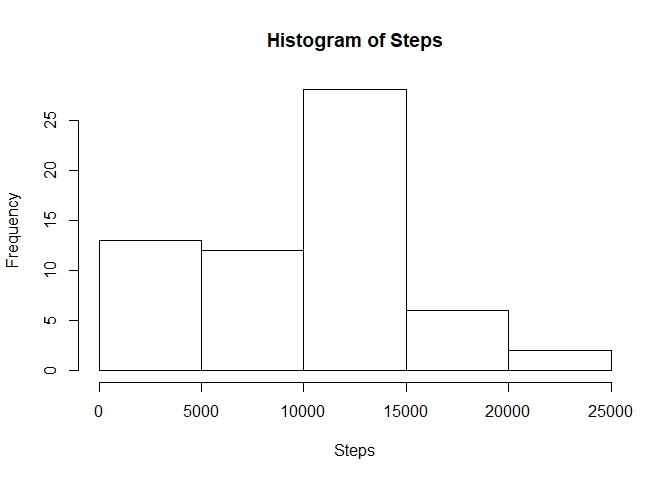
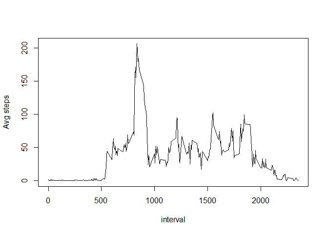
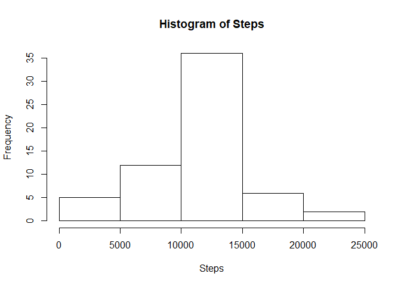
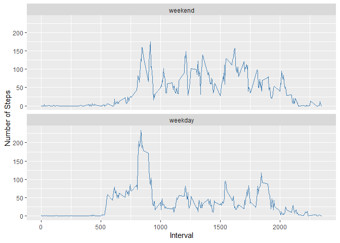

```r
library(data.table)
library(lubridate)
library(ggplot2)
```

## Loading and preprocessing the data

Having forked and cloned the git repository, unzip the data file


```r
unzip("activity.zip")
activity <- fread("activity.csv",header=TRUE,sep=",")
steps.per.day <- activity[,sum(steps, na.rm=TRUE),by=date]
names(steps.per.day) <- c("Date","Steps")
```

Display histogram of steps per day


```r
with(steps.per.day,hist(Steps))
```

<!-- -->

## What is mean total number of steps taken per day?

Calculate mean and median of steps per day

```r
mean(steps.per.day$Steps,na.rm=TRUE)
```

```
## [1] 9354.23
```

```r
median(steps.per.day$Steps,na.rm=TRUE)
```

```
## [1] 10395
```


## What is the average daily activity pattern?

Make a time series plot of the 5-minute interval (x-axis) and the average number of steps taken, averaged across all days (y-axis)


```r
intervals <- activity[,mean(steps,na.rm=TRUE),by=interval]
names(intervals) <- c("interval","Avg steps")
plot(intervals,type="l")
```

<!-- -->

Which interval is the max?


```r
max.interval = which.max(intervals$`Avg steps`)
intervals[max.interval,1]
```

```
##    interval
## 1:      835
```

## Imputing missing values

Calculate and report the total number of missing values in the dataset (i.e. the total number of rows with NAs)


```r
sum(is.na(activity$steps))
```

```
## [1] 2304
```

Devise a strategy for filling in all of the missing values in the dataset. The strategy does not need to be sophisticated. For example, you could use the mean/median for that day, or the mean for that 5-minute interval, etc.

I decided to use the average value of steps for that interval over the dataset.


```r
fill.in <- function( activity ) {
     for( i in 1:nrow(activity)) {
          if(is.na(activity[i,]$steps)) {
               activity[i,]$steps <- as.integer(intervals[interval == activity[i,]$interval,]$`Avg steps`)
          }
     }
     return(activity)
}
```
Create a new dataset that is equal to the original dataset but with the missing data filled in.


```r
new.activity <- fill.in(activity)
```

Make a histogram of the total number of steps taken each day and Calculate and report the mean and median total number of steps taken per day. Do these values differ from the estimates from the first part of the assignment? What is the impact of imputing missing data on the estimates of the total daily number of steps?


```r
steps.per.day.2 <- new.activity[,sum(steps),by=date]
names(steps.per.day.2) <- c("Date","Steps")
```

Display histogram of steps per day


```r
with(steps.per.day.2,hist(Steps))
```

<!-- -->

Calculate mean and median of steps per day


```r
mean(steps.per.day.2$Steps,na.rm=TRUE)
```

```
## [1] 10749.77
```

```r
median(steps.per.day.2$Steps,na.rm=TRUE)
```

```
## [1] 10641
```

With NAs present, in the histogram there are 8 days that record 0 steps for the day.  By handling the NAs, these days are reported as the median value of all days.

Therefore, the mean and median of steps per day increases.

## Are there differences in activity patterns between weekdays and weekends?

Create a new factor variable in the dataset with two levels – “weekday” and “weekend” indicating whether a given date is a weekday or weekend day.

Make a panel plot containing a time series plot (i.e. type = "l") of the 5-minute interval (x-axis) and the average number of steps taken, averaged across all weekday days or weekend days (y-axis). See the README file in the GitHub repository to see an example of what this plot should look like using simulated data.


```r
activity$wday <- wday(activity$date)
activity$wday.wkend <- factor(activity$wday,
                              levels=c(1,2,3,4,5,6,7),
                              labels=c("weekend","weekday",
                                       "weekday", "weekday",
                                       "weekday", "weekday",
                                       "weekend")
                              )

graph.data <- aggregate( steps ~ interval + wday.wkend,data=activity,mean)

ggplot(data = graph.data,aes(interval,steps)) +    
     geom_line(color="steelblue") + 
     facet_wrap( ~ wday.wkend,nrow=2) + 
     labs( x= "Interval", y= "Number of Steps")
```

<!-- -->
